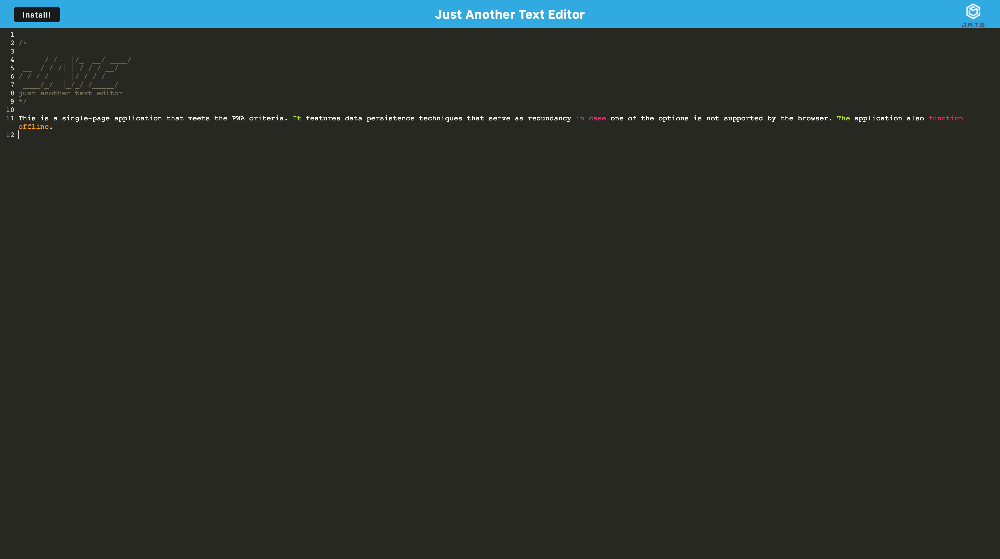

# PWA Text Editor
This is a single-page application that meets the PWA criteria. It features data persistence techniques that serve as redundancy in case one of the options is not supported by the browser. The application also function offline.

## Table of Contents
  - [Installation](#installation)
  - [Usage](#usage)
  - [Resources](#resources)
  - [Questions](#questions)

## Installation 
To install this application, do the following: 
 - Clone the repo to your local machine. 
 - Run "npm i" to install the dependencies. 
 - Run "npm start" to start your application. 

## Usage
Open the application and input text into the editor. Allow a little for the data to be stored, then close out the application, and the data will be retrieved. You can also disconnect your network and see it run offline. 

 

## Resources

[Webpack](https://webpack.js.org/)

## Questions

If you have questions about this application, my contact information is below. 

Github Account: [cameronfrench](https://github.com/cameronfrench)

Email Address: [cameron.french92@gmail.com](mailto:cameron.french92@gmail.com)